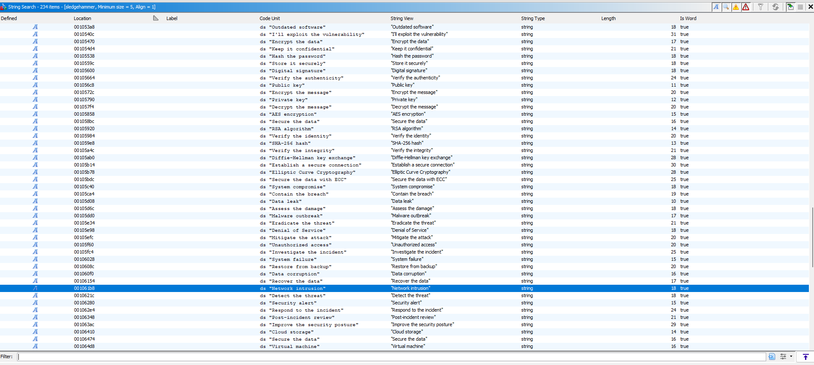

# DDC Regionals

## Beginner

## Cryptography

## Forensics 

## Binary 

## Reverse engineering

### sledgehammer 

Challenge beskrivelse: 

Hej! Jeg hørte du er en mester. Kan du svare rigtigt på alle spørgsmålene?


Min løsning: 

Først tjekkede jeg filtypen. 
```bash
┌──(kali㉿kali)-[~/Desktop]
└─$ file sledgehammer 
sledgehammer: ELF 64-bit LSB pie executable, x86-64, version 1 (SYSV), dynamically linked, interpreter /lib64/ld-linux-x86-64.so.2, BuildID[sha1]=a29f78c01db053a982d5d929bde9fb86d0b918e3, for GNU/Linux 3.2.0, not stripped
```
Dernæst prøvede jeg at eksekvere filen. 
```bash
┌──(kali㉿kali)-[~/Desktop]
└─$ ./sledgehammer
  Network intrusion
```

Dette gav mig ikke så meget at gå videre med. Jeg loadede dernæst filen op i Ghidra og kørte auto-analyse.


Dernæst tjekkede jeg for strings, og sorterede efter størrelsen på addressen. 



Det ligner svaret bliver givet efter spørgsmålet. Jeg prøvede dernæst at give programmet "Detect the threat"

```bash
┌──(kali㉿kali)-[~/Desktop]
└─$ ./sledgehammer
  Network intrusion
Detect the threat
  Awesome!
```

Det virkede. Jeg gennemgik manuelt resten og fik flaget som endte med at være første bogstav for hvert svar. 

Dog gav dette mig chancen for at bruge pwntools biblioteket i Python for at automatisere det. Programmet indeholder et array kaldet flag, hvor local_88 bliver brugt som indeksering. Dernæst bliver der brugt lidt bit manipulation. 

Det vil sige jeg blot kan automatisere denne process. Dette implementerede jeg med dette script: 
```python
from pwn import *

elf = ELF("./sledgehammer")
base_address = elf.address  

flag = bytearray.fromhex("1e5b5c6145321b301d165f142e2b23211329070b4a243615") #flag array fra ghidra


for i in range(len(flag)): 
	ans_offset = 0x104084-0x100000 #offset for "pairs" minus ghidras standard offset
	index_val = (flag[i]*0x25)%0x61 #ivar1 variablen i Ghidra
	target_address = index_val*200+ans_offset #kalkulerer adressen for svaret
	data = elf.read(target_address, 100) #læser 100 bytes på adressen
	data = data.split(b'\x00')[0] #fjerner alle null bits
	print(data.decode("utf-8")[0],end="") #printer kun det første bogstav
```
Hvis dette script eksekveres får man følgende output:
```bash 
┌──(kali㉿kali)-[~/Desktop]
└─$ python slegdehammer_rev.py
[*] '/home/kali/Desktop/sledgehammer'
    Arch:       amd64-64-little
    RELRO:      Full RELRO
    Stack:      Canary found
    NX:         NX enabled
    PIE:        PIE enabled
    SHSTK:      Enabled
    IBT:        Enabled
    Stripped:   No
DDC{SLEDGEHAMMERISMYJAM} 
```

## Misc 
